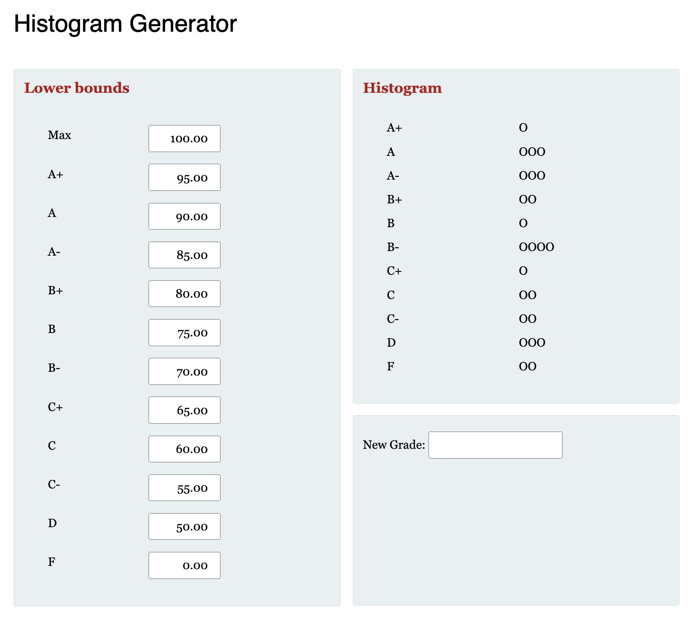

# Assignment 1
## Part A - HTML/CSS:
Create two files called “histogram.html” and “histogram.css” to recreate (as close as possible) the picture below, leaving out the circles on right hand side of the “Histogram” div box. The values of the input boxes should also be initialized accordingly.


You may make any reasonable guesses on fonts, colors and measurements. 

## Part B – JavaScript
Create a file called “calculate.js”.  This file will contain a variable array called ‘grades’ representing the grades of all students in a particular class. For this assignment, you may hard code this into your JavaScript file. For example, the result above could have been generated from the following array

```
var grades = [65.95, 56.98, 78.62, 96.1, 90.3, 72.24, 92.34, 60.00, 81.43, 86.22, 88.33, 9.03,
49.93, 52.34, 53.11, 50.10, 88.88, 55.32, 55.69, 61.68, 70.44, 70.54, 90.0, 71.11, 80.01];
```

Please note that there is one student in the A+ range, three students in the A range, etc…

### Features:
1. The user will be allowed to enter new values into this array by entering the number in the "New Grade" textbox. For this feature, the user shall be able to press enter to add the new value into the array or alternatively, you may wish to add a "submit" button.
2. Each time the user changes the lower bounds of any of the letter-grades or when a new grade item is entered, the Histogram should dynamically adjust itself to represent the number of students in each range. I used the letter ‘O’ to represent a student, but please be creative here, you can use table cells, div box widths, etc.
3. If there is an invalid input of any kind, i.e. bounds of letter-grades overlap, string is entered as input, your program should deal with it accordingly (it is up to you how you’d like to do that :D). Try to give useful feedback, try to imagine yourself using such a system.

Hint: You may want to consider JavaScript events/functions:

**onkeypress()**


**onkeyup()**


**getElementsByTagName()**


**getElementsByName()**
### Deploying
Your application must be deployed to a host. I suggest **one** of the following:
1. Railway
2. Render

### Usability and Effort:
A small portion of the grade will be dedicated to usability and effort, this is learnability and like-ability. The existence of bugs and lack of error checking may result in a lower usability score.  

### Constraints:

You may not use frontend frameworks or libraries such as Angular, React, Bootstrap, or jQuery in this assignment.  You will have many opportunities to use these (if you'd like) in the future 

### Marking Scheme:
Part A –
4 marks: The colors, fonts, and spacing should follow the picture **as much as possible**. For example, a shade of red would be a reasonable guess at the background color of the page; a shade of blue would not. The following site may give you some insight:
SFU Toolkit

Part B –
12 marks: The correct values should be calculated and all described functions should be working.
4 marks: Usability. 

Deploying: 3 Marks
Running on Host
the project pushed onto GitHub - We must be able to find your working app at the web app URL and should be able to see your code at the Git link.

### Submission:
Your webpage must be stored in your Spring application's “static” folder and pushed to the hosting platform (Railway or Azure). As with all subsequent assignments/project iterations, you should submit a text file with the following information onto Canvas.
1. The URL of your web app; this is where we can play around with your application. It is your responsibility to ensure that you have the correct URL.  If the TAs cannot find it, he/she cannot mark it.
2. Your Git link, this is where we can view your code, progress and submission time.
If you cannot push it to the hosting platform, you may get partial marks if you upload your work as a zip file.

## My Work Demonstration
![Watch My Assignment Demo][https://github.com/NormanCao2702/cmpt276asgn1/issues/1#issue-2485518720]